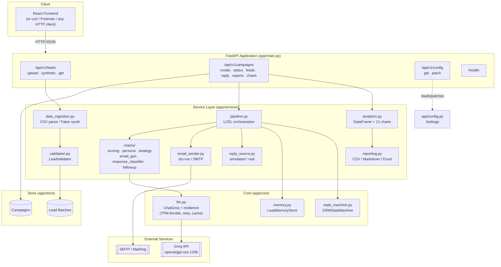
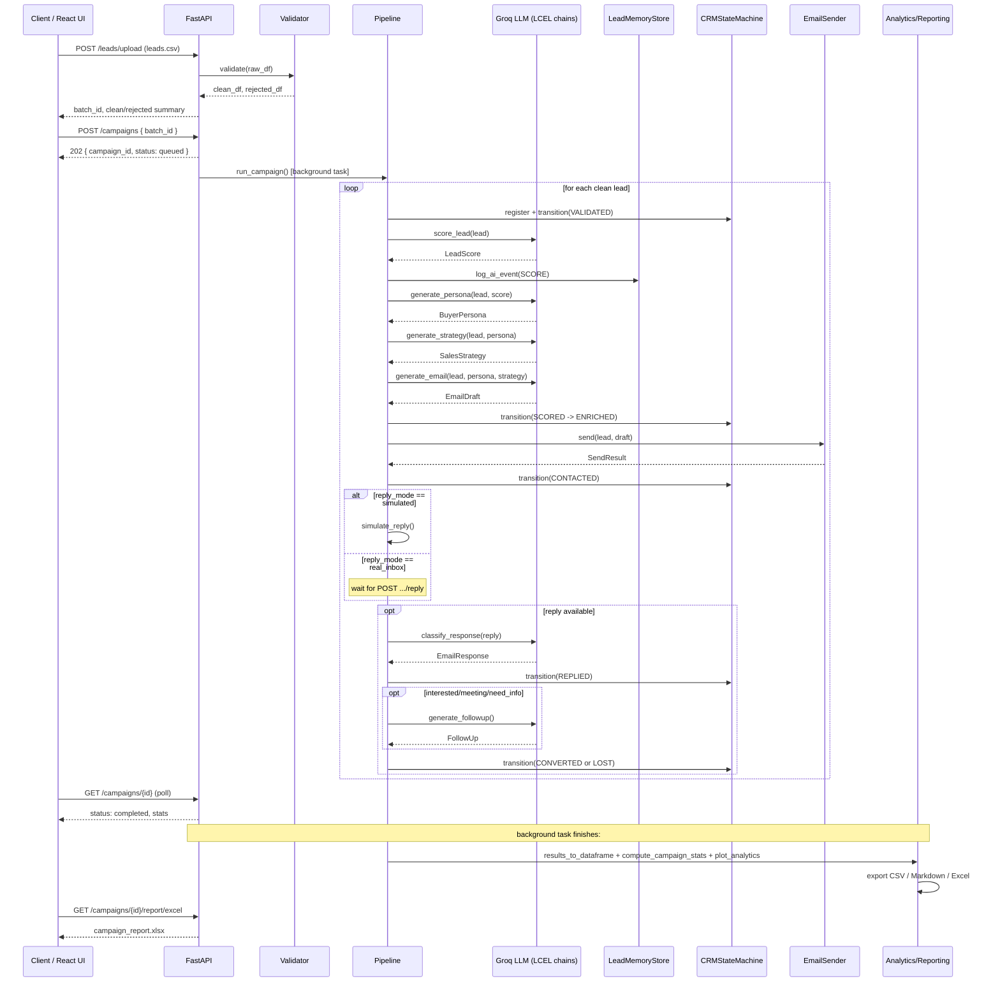

# B2B CRM & Lead Generation Automation Engine

**LangChain (LCEL) + Groq (`openai/gpt-oss-120b`) + FastAPI**

A production-structured backend that turns a raw list of B2B leads into a fully
worked sales campaign: AI qualification, buyer-persona generation, sales
strategy, personalized outreach email, (simulated or real) delivery, reply
classification, follow-up generation, lifecycle tracking, analytics, and
downloadable reports -- all exposed over a REST API so a React frontend (or
anything else) can drive it.

## Project Overview

The system automates the entire top-of-funnel of a B2B sales pipeline:

```
CSV of leads -> validate/clean -> AI score -> AI persona -> AI strategy ->
AI-written email -> send (real or dry-run) -> reply -> AI classify ->
AI follow-up -> lifecycle tracking -> analytics -> CSV/Markdown/Excel report
```

Everything AI-related runs through **LangChain's LCEL (LangChain Expression
Language)**, calling **Groq** (`openai/gpt-oss-120b` by default, any Groq
chat model works) with **native structured output** (`llm.with_structured_output(Model)`)
so every AI response is a validated Pydantic object, never raw text you have
to hope parses as JSON.

The API is built with **FastAPI** because it gives free: automatic
OpenAPI/Swagger docs at `/docs`, request/response validation via the same
Pydantic models used internally, native `async` support which made this port fast and low-risk.

## Objective & Features

**Objective:** give a sales team (a reviewer, or a downstream
React app) a single API that takes a CSV of leads and comes back with a fully
qualified, personalized, tracked outbound campaign -- without needing to touch of teams.

**What it does, and what it's built with:**

| Feature | Built with |
|---|---|
| CSV ingestion + validation (schema check, email format, dedup, company-size normalization) | pandas, a hand-rolled `LeadValidator` |
| Synthetic lead generation for demos/testing | Faker |
| AI lead scoring (1-10, priority, conversion probability, buying intent) | LangChain LCEL + Groq structured output |
| AI buyer-persona generation (pain points, goals, objections, triggers, risk factors...) | LangChain LCEL + Groq structured output |
| AI sales-strategy generation (positioning, value prop, objection handling, closing strategy) | LangChain LCEL + Groq structured output |
| AI personalized email generation (subject, body, CTA, tone, subject line variants) | LangChain LCEL + Groq structured output |
| Simulated or real email delivery, with retry + exponential backoff | `smtplib` (or MailHog in dev) |
| AI reply classification (interested / not interested / meeting requested / spam / bounce / ...) | LangChain LCEL + Groq structured output |
| AI follow-up email generation, memory-aware (uses the full conversation transcript) | LangChain LCEL + Groq structured output, `InMemoryChatMessageHistory` |
| CRM lifecycle state machine (`NEW -> VALIDATED -> SCORED -> ENRICHED -> CONTACTED -> REPLIED -> CONVERTED/LOST`) | plain Python |
| Resilience: TPM (tokens-per-minute) self-throttling, retry-with-backoff that respects Groq's own "try again in Ns" hint, in-memory prompt caching | custom `invoke_with_resilience()` wrapper around every chain |
| Campaign analytics: 12 charts (funnel, outcome breakdown, conversion by priority, score by outcome, follow-up effectiveness, ...) | matplotlib, seaborn |
| Reporting: processed-leads CSV, narrative Markdown report with embedded charts, multi-sheet Excel workbook | pandas, openpyxl |
| Background execution so large campaigns don't block the HTTP request | FastAPI `BackgroundTasks` |
| Config switches for demo vs. production behavior (see below) | pydantic-settings |

## System Architecture

The service is organized in four layers, each with one job:

- **API layer** (`app/api`) -- HTTP concerns only: request parsing, response
  shaping, status codes, background-task scheduling. No business logic lives
  here.
- **Service layer** (`app/services`) -- the actual business logic: ingestion,
  validation, the six AI chains, email sending, reply handling, pipeline
  orchestration, analytics, and reporting. This layer is framework-agnostic --
  every function here would work identically if called from a CLI script or
  a Celery worker instead of FastAPI.
- **Core layer** (`app/core`) -- cross-cutting infrastructure shared by every
  service: the Groq client + resilience wrapper, per-lead conversational
  memory, and the CRM state machine.
- **Store layer** (`app/store`) -- in-process state: uploaded lead batches and
  running/completed campaigns, keyed by generated IDs. Deliberately simple
  (see [Future Improvements](#future-improvements) for how to swap this for
  Redis/Postgres at scale).

A campaign is the unit of work: it owns its own `CRMStateMachine`,
`LeadMemoryStore`, and `EmailSender`, so multiple campaigns can run
concurrently (in separate background tasks) without sharing state or
clobbering each other's conversation memory.

## Architecture Diagram



## Tech Stack

| Layer | Technology |
|---|---|
| Web framework | FastAPI 0.115 (ASGI, async-native) |
| ASGI server | Uvicorn (dev) / Gunicorn+UvicornWorker (production) |
| LLM orchestration | LangChain 0.3 (LCEL: `RunnableSequence`, `RunnableLambda`) |
| LLM provider | Groq (`openai/gpt-oss-120b`, swappable to any Groq chat model) |
| Data validation / schemas | Pydantic v2 (domain models + API contracts + LLM structured output schemas -- one model definition, three jobs) |
| Settings management | pydantic-settings (typed, `.env`-backed, cached singleton) |
| Data processing | pandas, NumPy |
| Charts | matplotlib + seaborn (headless `Agg` backend) |
| Spreadsheet export | openpyxl |
| Synthetic data | Faker |
| Email | Python `smtplib` (real) / MailHog (dev fake SMTP + web UI) |
| Frontend (planned) | React (Vite), consuming the REST API -- see [Connecting a React Frontend](#connecting-a-react-frontend) |

## Frameworks in Detail

### FastAPI

Chosen over Flask/Django because: (1) native Pydantic integration means the
same `BaseModel` classes double as request validation, response
serialization, *and* OpenAPI schema generation -- zero duplication; (2) native
`async def` + `BackgroundTasks` fits the "kick off a slow AI campaign, return
immediately, poll for status" pattern this project needs without pulling in
Celery/Redis for a first version; (3) `/docs` (Swagger UI) and `/redoc` come
free, which matters a lot for a frontend team integrating against this API.

### LangChain (LCEL)

Every AI stage is expressed as a `RunnableSequence`:
`ChatPromptTemplate | llm.with_structured_output(PydanticModel)`. LCEL's `|`
operator composition is used both *within* a single chain (prompt -> LLM) and
*across* the whole per-lead pipeline (`stage_score | stage_persona |
stage_strategy | stage_email`, see `app/services/pipeline.py`), so the whole
lead lifecycle reads as one declarative sequence rather than a tangle of
manually-wired function calls.

`llm.with_structured_output(Model)` is used instead of a text-based
`PydanticOutputParser` -- it forces the model's response into the target
schema via the provider's native tool-calling/JSON-schema mode, which
eliminates the "the model almost returned valid JSON but not quite" failure
mode entirely.

### Groq

Selected as the only LLM provider per project requirements -- fast inference,
generous free tier, OpenAI-compatible-ish tool-calling support that
`with_structured_output` depends on. The default model,
`openai/gpt-oss-120b`, is an open-weights model hosted on Groq's LPU
infrastructure; any other Groq chat model that supports tool calling
(e.g. `llama-3.3-70b-versatile`) is a drop-in replacement via `MODEL_NAME`.

### Pydantic v2

Used in three distinct roles that all happen to be the same class in some
cases:
1. **Domain models** (`app/models/schemas.py`) -- the shape of a `Lead`,
   `LeadScore`, `BuyerPersona`, etc.
2. **LLM structured-output schemas** -- the exact same classes are passed to
   `llm.with_structured_output(...)`, so the AI's JSON Schema *is* the
   domain model's JSON Schema. One source of truth.
3. **API contracts** (`app/models/api_schemas.py`) -- request/response shapes,
   kept in a separate module so a future change to an internal pipeline
   shape doesn't silently break the public API.

## Complete Folder Explanation

```
crm-ai-backend/
|-- app/
|   |-- main.py                      # FastAPI app: creates the app, wires
|   |                                 # middleware (CORS) and routers, configures
|   |                                 # logging, exposes / and startup logging.
|   |-- config.py                    # Settings (pydantic-settings): every env var
|   |                                 # in the project, typed, defaulted, cached via
|   |                                 # @lru_cache. Single source of truth for config.
|   |
|   |-- models/
|   |   |-- enums.py                 # DataSource, ReplyMode, SendMode, LifecycleStage,
|   |   |                            # CampaignStatus -- shared vocabulary across the app.
|   |   |-- schemas.py               # Domain models: Lead, LeadScore, BuyerPersona,
|   |   |                            # SalesStrategy, EmailDraft, EmailResponse, FollowUp,
|   |   |                            # LeadLifecycleState, ProcessedLead, CampaignStats,
|   |   |                            # CampaignReport. Ported 1:1 from the notebook.
|   |   `-- api_schemas.py           # Request/response contracts for every endpoint.
|   |
|   |-- core/
|   |   |-- llm.py                   # Builds the shared ChatGroq client;
|   |   |                            # invoke_with_resilience() = caching + TPM
|   |   |                            # self-throttling + retry/backoff + timing.
|   |   |-- memory.py                # LeadMemoryStore: per-lead InMemoryChatMessageHistory,
|   |   |                            # scoped to one campaign, discarded after.
|   |   `-- state_machine.py         # CRMStateMachine: lifecycle stage transitions
|   |                                 # + validity checking + history tracking.
|   |
|   |-- services/
|   |   |-- data_ingestion.py        # generate_synthetic_leads() (Faker) and
|   |   |                            # load_csv_leads_from_bytes() (uploaded CSV parsing).
|   |   |-- validation.py            # LeadValidator: schema check, missing-value /
|   |   |                            # email-format checks, dedup, company-size
|   |   |                            # normalization. Returns clean + rejected DataFrames.
|   |   |-- chains/
|   |   |   |-- scoring.py           # AI Chain 1: lead scoring.
|   |   |   |-- persona.py           # AI Chain 2: buyer persona.
|   |   |   |-- strategy.py          # AI Chain 3: sales strategy.
|   |   |   |-- email_gen.py         # AI Chain 4: personalized email.
|   |   |   |-- response_classifier.py # Classifies an inbound reply.
|   |   |   `-- followup.py          # Generates a memory-aware follow-up email.
|   |   |-- email_sender.py          # EmailSender: dry-run or real SMTP, retry+backoff.
|   |   |-- reply_source.py          # simulate_reply() / get_lead_reply() -- the
|   |   |                            # ReplyMode dispatch point.
|   |   |-- pipeline.py              # process_lead() / run_campaign() / apply_reply() --
|   |   |                            # the LCEL orchestration tying every stage together.
|   |   |-- analytics.py             # results_to_dataframe(), compute_campaign_stats(),
|   |   |                            # plot_analytics() -- the 12-chart analytics suite.
|   |   `-- reporting.py             # generate_insights_and_recommendations(),
|   |                                 # export_csv/markdown/excel.
|   |
|   |-- store/
|   |   `-- campaign_store.py        # In-process LeadBatch + Campaign stores
|   |                                 # (thread-locked dicts). See "Future Improvements"
|   |                                 # for swapping to Redis/Postgres at scale.
|   |
|   |-- api/
|   |   |-- deps.py                  # Shared FastAPI dependency re-exports.
|   |   `-- routes/
|   |       |-- health.py            # GET /health
|   |       |-- leads.py             # POST /leads/upload, /leads/synthetic, GET /leads/{id}
|   |       |-- campaigns.py         # Everything campaign-related (see endpoint list below)
|   |       `-- config.py            # GET/PATCH /config
|   |
|   `-- utils/                       # Reserved for small shared helpers as the
|                                     # project grows (currently empty on purpose).
|
|-- storage/                         # Runtime data, mounted as a Docker volume.
|   |-- uploads/                     # (reserved for saved raw uploads if you extend
|   |                                 #  the upload endpoint to persist originals)
|   |-- outputs/{campaign_id}/       # leads_processed.csv + all chart PNGs per campaign
|   |-- reports/{campaign_id}/       # campaign_report.md + campaign_report.xlsx
|   `-- logs/                        # pipeline.log
|
|-- sample_data/
|   `-- leads.csv                    # A ready-to-use sample file for POST /leads/upload
|
|-- frontend/                        # Placeholder for the React app (see its own README.md)
|
|-- tests/
|   `-- test_health.py               # Smoke tests (health, root, synthetic-lead flow)
|
|-- requirements.txt                 # Pinned Python dependencies
|-- .env.example                     # Every environment variable, documented
|-- .gitignore
|-- README.md                        # This file
```

## Installation

**Prerequisites:** Python 3.10+, a Groq API key (free -- see
[Groq Setup](#groq-setup)), and optionally Docker if you'd rather not manage
a virtualenv.

### Local (Python virtualenv)

```bash
git clone <your-repo-url> crm-ai-backend
cd crm-ai-backend

python3 -m venv .venv
source .venv/bin/activate            # Windows: .venv\Scripts\activate

pip install -r requirements.txt

cp .env.example .env
# now edit .env and set GROQ_API_KEY at minimum

uvicorn app.main:app --reload
```

Visit **http://localhost:8000/docs** for interactive Swagger docs.


This starts the API on `:8000` and a MailHog fake-SMTP server on `:8025`
(web UI) / `:1025` (SMTP) so you can test `DRY_RUN=false` locally without
ever sending real email -- see [Actual vs. Simulation Switches](#actual-vs-simulation-switches).

## Dependencies

All pinned in `requirements.txt`:

```
fastapi              # web framework
uvicorn[standard]     # ASGI server
python-multipart      # required by FastAPI for file uploads (CSV)
pydantic              # data validation / schemas
pydantic-settings     # typed, .env-backed configuration

langchain             # LCEL orchestration
langchain-core        # Runnable primitives (RunnableSequence, RunnableLambda)
langchain-groq        # ChatGroq client

pandas, numpy         # data processing
matplotlib, seaborn   # chart rendering
openpyxl              # Excel (.xlsx) export
faker                 # synthetic lead generation

python-dotenv         # .env loading (used implicitly by pydantic-settings)
tqdm                  # present for parity with the notebook / future CLI tooling
```

Install/upgrade with `pip install -r requirements.txt`. Versions are pinned
for reproducibility -- bump them deliberately (`pip install -U <pkg>` then
re-pin) rather than letting them float.

## Configuration

All configuration lives in `app/config.py` as a single `Settings` class
(pydantic-settings), populated from environment variables / a `.env` file.
**No module anywhere else hardcodes a path, a model name, or a mode** -- every
service function takes its configuration in (either via `app.config.settings`
directly, or via an explicit parameter for things that vary per-campaign).

Settings fall into four groups:

1. **Infrastructure** (model name, TPM limits, SMTP host, storage paths) --
   meant to be set once per environment and not changed at runtime.
2. **Runtime switches** (`dry_run`, `reply_mode`, `default_data_source`) --
   meant to be flippable without a redeploy, via `PATCH /api/v1/config`.
3. **Resilience tuning** (retry count, backoff base, rate-limit delay, cache
   toggle) -- infrastructure, but worth understanding; see
   [Performance Tips](#performance-tips).
4. **CORS** -- the list of origins allowed to call this API from a browser
   (your React dev server / production frontend domain).

## Actual vs. Simulation Switches

This project has **two independent "real vs. simulated" switches**, both
carried over from the original notebook's design and both changeable without
touching code:

### 1. Data source -- synthetic vs. real CSV

This isn't a config flag so much as **which endpoint you call**:

- `POST /api/v1/leads/upload` -- submit your real `leads.csv`. This is the
  primary, production path, and the one this project is built around ("I
  will submit the information CSV file through endpoints").
- `POST /api/v1/leads/synthetic?count=N` -- generates `N` realistic
  Faker-based leads instead, for demos, load-testing, or working on the
  frontend without a real lead list handy.

Both converge on an identical `LeadBatchSummary` response shape and an
identical `batch_id` you pass to `POST /api/v1/campaigns` -- every downstream
stage (validation, scoring, persona, ..., reporting) is 100% agnostic to
which path produced the batch.

### 2. Send mode -- dry-run vs. live SMTP

Controlled by `DRY_RUN` (env var / `.env`) with a per-campaign override via
`POST /api/v1/campaigns { "dry_run": true|false }`, and live-flippable via
`PATCH /api/v1/config { "dry_run": false }` for all *future* campaigns.

- **`dry_run=true` (default)** -- `EmailSender` never opens a socket. It logs
  what *would* have been sent and returns `status="dry_run"`. Completely
  safe default; nothing external happens.
- **`dry_run=false`** -- connects to `SMTP_HOST:SMTP_PORT` (defaults to
  MailHog in the Docker Compose setup, so even "live" sends stay contained
  to a fake inbox you can view at `http://localhost:8025` until you point
  `SMTP_HOST` at a real provider) and sends for real, with retry +
  exponential backoff on failure.

### 3. Reply mode -- simulated vs. real inbox

Controlled by `REPLY_MODE` (env var), with the same per-campaign /
`PATCH /api/v1/config` override pattern as above.

- **`simulated` (default)** -- during the campaign run, every contacted lead
  has a ~75% chance of getting a plausible, randomly-templated reply
  fabricated on the spot, so you can see the *entire* lifecycle (reply ->
  classification -> follow-up -> converted/lost) immediately, without waiting
  on a real inbox. These are clearly not real replies -- don't mistake them
  for customer signal.
- **`real_inbox`** -- the pipeline does **not** fabricate anything. Replies
  arrive later via `POST /api/v1/campaigns/{campaign_id}/leads/{lead_id}/reply`
  with `{ "reply_text": "..." }`. This is the intended integration point for
  a real email provider's inbound-mail webhook (SendGrid Inbound Parse,
  Postmark inbound, Mailgun Routes, or a simple IMAP-polling worker you add
  later that calls this same endpoint) -- the classification -> follow-up ->
  lifecycle-transition logic is *identical* either way, so switching modes
  never changes downstream behavior, only where the reply text comes from.

## Environment Variables

All documented with defaults in `.env.example`; copy it to `.env` and adjust.

| Variable | Default | Description |
|---|---|---|
| `APP_ENV` | `development` | `development` or `production` (used for logging/behavior hints) |
| `CORS_ORIGINS` | `["http://localhost:3000","http://localhost:5173"]` | JSON list of allowed frontend origins |
| `GROQ_API_KEY` | *(empty)* | **Required.** Your Groq API key |
| `MODEL_NAME` | `openai/gpt-oss-120b` | Any Groq chat model that supports tool calling |
| `TEMPERATURE` | `0.4` | LLM sampling temperature |
| `MAX_TOKENS` | `2048` | Baseline max tokens; individual chains request more (see `chains/*.py`) |
| `DEFAULT_DATA_SOURCE` | `csv` | `csv` or `synthetic` -- only relevant for non-API/background usage |
| `DRY_RUN` | `true` | See [switches](#actual-vs-simulation-switches) |
| `REPLY_MODE` | `simulated` | See [switches](#actual-vs-simulation-switches) |
| `RETRY_COUNT` | `5` | Max attempts per LLM/SMTP call |
| `RATE_LIMIT_DELAY` | `1.2` | Seconds slept before every LLM call |
| `BACKOFF_BASE` | `2.0` | Exponential backoff base (`base ** attempt` seconds) |
| `TPM_LIMIT` | `8000` | Your Groq account's tokens-per-minute limit |
| `TPM_SAFETY_MARGIN` | `0.85` | Self-throttle at this fraction of `TPM_LIMIT` |
| `CACHE_ENABLED` | `true` | In-memory dict cache for identical prompt payloads |
| `SMTP_HOST` / `SMTP_PORT` | `localhost` / `1025` | MailHog defaults in dev |
| `SMTP_USERNAME` / `SMTP_PASSWORD` | *(empty)* | Only needed for authenticated SMTP |
| `SMTP_USE_TLS` | `false` | Set `true` for providers requiring STARTTLS |
| `SMTP_SENDER_ADDRESS` | `sales-ai@yourcompany.com` | `From:` address |
| `STORAGE_DIR` / `UPLOADS_DIR` / `OUTPUT_DIR` / `REPORT_DIR` / `LOG_DIR` | `storage/...` | Filesystem paths; mount `storage/` as a volume in Docker |
| `LOG_LEVEL` | `INFO` | Standard Python logging level |

## Groq Setup

1. Create a free account at **https://console.groq.com**.
2. Go to **API Keys** -> **Create API Key**, copy it.
3. Put it in `.env`: `GROQ_API_KEY=gsk_...`
4. (Optional) Check your account's rate limits under **Settings -> Limits** --
   if your tier's tokens-per-minute limit differs from the default `8000`,
   update `TPM_LIMIT` accordingly so the self-throttler budgets correctly.
5. (Optional) Swap `MODEL_NAME` to any other Groq-hosted chat model that
   supports tool calling (required for `with_structured_output`), e.g.
   `llama-3.3-70b-versatile`.

The API refuses to start a campaign (`503`) if `GROQ_API_KEY` is unset or
still the placeholder value -- you'll see this immediately at
`POST /api/v1/campaigns` rather than failing deep inside a background task.

## Running FastAPI

### Development

```bash
uvicorn app.main:app --reload --host 0.0.0.0 --port 8000
```

- Swagger UI: `http://localhost:8000/docs`
- ReDoc: `http://localhost:8000/redoc`
- Health check: `http://localhost:8000/health`

### Production

Don't use `--reload` or a single Uvicorn process in production. Use Gunicorn
managing Uvicorn workers:

```bash
gunicorn app.main:app \
    --workers 4 \
    --worker-class uvicorn.workers.UvicornWorker \
    --bind 0.0.0.0:8000 \
    --timeout 120
```

> Multi-worker caveat: `app/store/campaign_store.py` uses in-process
> dicts. With more than one worker process, a campaign created by worker A is
> invisible to worker B, and polling `GET /campaigns/{id}` may 404
> intermittently depending on which worker handles the request. Either run a
> single worker (fine for now) or move the store to
> Redis first -- see [Future Improvements](#future-improvements).

Put a reverse proxy (Nginx, Caddy, or your cloud provider's load balancer) in
front for TLS termination and static asset serving if you add one.

## All Endpoints

Base path: `/api/v1` (except `/health` and `/`, which are unprefixed).

### Health

| Method | Path | Description |
|---|---|---|
| GET | `/` | Root -- links to docs/health |
| GET | `/health` | Liveness/readiness check (used by Docker `HEALTHCHECK`) |

### Leads

| Method | Path | Description |
|---|---|---|
| POST | `/api/v1/leads/upload` | **Primary ingestion path.** Multipart CSV upload (`file` field). Validates immediately; returns a `batch_id` plus clean/rejected counts and samples. |
| POST | `/api/v1/leads/synthetic?count=10` | Generates `count` Faker-based demo leads through the same validation path. |
| GET | `/api/v1/leads/{batch_id}` | Fetch a batch's summary (larger sample, up to 25 rows each of clean/rejected). |

### Campaigns

| Method | Path | Description |
|---|---|---|
| POST | `/api/v1/campaigns` | Body: `{ "batch_id": "...", "dry_run": bool?, "reply_mode": "simulated"|"real_inbox"? }`. Starts a campaign as a background task; returns immediately with `status="queued"`. |
| GET | `/api/v1/campaigns/{campaign_id}` | Poll status (`queued`/`running`/`completed`/`failed`), progress (`processed`/`total`), and -- once completed -- full `CampaignStats`. |
| GET | `/api/v1/campaigns/{campaign_id}/leads` | Every processed lead (score, persona, strategy, email draft, send result, reply, response, follow-up, lifecycle) as JSON. |
| GET | `/api/v1/campaigns/{campaign_id}/leads/{lead_id}` | Single lead's full detail. |
| POST | `/api/v1/campaigns/{campaign_id}/leads/{lead_id}/reply` | Body: `{ "reply_text": "..." }`. The real-inbox reply path -- triggers classification, optional follow-up, and lifecycle transition. |
| GET | `/api/v1/campaigns/{campaign_id}/report/csv` | Download `leads_processed.csv`. |
| GET | `/api/v1/campaigns/{campaign_id}/report/markdown` | Download `campaign_report.md` (narrative report with embedded chart references). |
| GET | `/api/v1/campaigns/{campaign_id}/report/excel` | Download `campaign_report.xlsx` (Leads / Failures / Analytics / Outcome Summary / Replies & Follow-ups sheets). |
| GET | `/api/v1/campaigns/{campaign_id}/charts` | List available chart filenames. |
| GET | `/api/v1/campaigns/{campaign_id}/charts/{chart_name}` | Download/view a single chart PNG. |

Report and chart endpoints return `409 Conflict` if the campaign hasn't
finished yet -- poll `GET /campaigns/{id}` until `status == "completed"`
first.

### Config

| Method | Path | Description |
|---|---|---|
| GET | `/api/v1/config` | Current effective configuration (secrets never included). |
| PATCH | `/api/v1/config` | Body: any of `{ "dry_run": bool, "reply_mode": "...", "default_data_source": "..." }`. Updates server-wide defaults for future campaigns. |

## Data Flow Diagram



## User Flow (Full Experience) [See Storage](storage)

This is the intended end-to-end experience once a frontend is wired up
against this API (see [Connecting a React Frontend](#connecting-a-react-frontend)):

1. **Upload leads.** The user lands on an "Upload" screen, drags in a
   `leads.csv` (columns: `name, email, company, role, industry,
   company_size, website`), and hits submit. The frontend calls
   `POST /leads/upload`. The response shows immediately how many rows were
   clean vs. rejected, with the specific rejection reason per row (missing
   field, bad email format, etc.) so the user can fix and re-upload if the
   rejection rate looks high. No AI has run yet -- this step is instant and free.

2. **Configure the run (optional).** Before starting, the user can toggle
   "Send emails for real" (maps to `dry_run: false`) and "Wait for real
   replies" (maps to `reply_mode: real_inbox`) -- both default to the safe,
   simulated behavior so a first-time user can't accidentally spam real
   inboxes.

3. **Launch the campaign.** The frontend calls `POST /campaigns` with the
   `batch_id` and gets back a `campaign_id` immediately (`202 Accepted`,
   `status: queued`) -- the UI doesn't hang waiting for 50 leads' worth of LLM
   calls.

4. **Watch it run.** The frontend polls `GET /campaigns/{id}` every couple of
   seconds, showing a progress bar from `progress.processed` /
   `progress.total` and a spinner labeled `status: running`. Because Groq is
   fast and the pipeline is TPM-throttled rather than blindly retried, this
   is typically seconds-to-low-minutes for a few dozen leads.

5. **See the results land.** Once `status: completed`, the UI fetches
   `GET /campaigns/{id}/leads` and renders a sortable/filterable table: name,
   company, score, priority, persona title, email subject, send status, and
   -- for leads that "replied" (simulated or real) -- classification, lead
   temperature, and whether a follow-up went out. Clicking a row opens the
   full detail (`GET /campaigns/{id}/leads/{lead_id}`): the complete
   generated persona, strategy, email body, and follow-up text, so the user
   can read exactly what the AI wrote and why (the `reasoning` and
   `personalization_notes` fields make this auditable, not a black box).

6. **Explore the analytics.** A dashboard tab renders the 12 charts (funnel,
   outcome breakdown, conversion by priority tier, score by outcome, ...) by
   pointing `` tags at `GET /campaigns/{id}/charts/{name}`, backed by
   `GET /campaigns/{id}/charts` for the list.

7. **Handle real replies (if `reply_mode: real_inbox`).** As real replies
   come in (via an email-webhook integration calling
   `POST /campaigns/{id}/leads/{lead_id}/reply`, or a "paste a reply
   manually" text box in the UI for testing), the corresponding lead row
   updates live on next poll -- classification and follow-up appear, and its
   lifecycle stage advances.

8. **Export and hand off.** The user downloads `campaign_report.xlsx` (for a
   sales manager) or `campaign_report.md` (for a Slack/Notion post) or the
   raw `leads_processed.csv` (to import into another CRM), all via direct
   links to the report endpoints.

## Performance Tips

- **TPM throttling matters more than retry count.** `TPM_LIMIT` /
  `TPM_SAFETY_MARGIN` proactively space out calls to stay under your Groq
  account's tokens-per-minute budget *before* a 429 happens, which is far
  faster in practice than retrying after the fact. Set `TPM_LIMIT` to match
  what your Groq account page actually shows -- an under-set limit
  needlessly throttles you; an over-set one causes avoidable 429s.
- **Enable the prompt cache in dev.** `CACHE_ENABLED=true` (default) means
  re-running a campaign against the same batch during development doesn't
  re-spend tokens on identical payloads. Disable it only if you're testing
  non-determinism (`TEMPERATURE > 0` output variety) on purpose.
- **Batch size vs. background task duration.** Every lead makes 4-6
  sequential LLM calls (score -> persona -> strategy -> email -> optional
  classify -> optional follow-up). For very large CSVs (500+ rows), consider
  chunking uploads client-side, or extend `run_campaign()` to process leads
  concurrently with `asyncio.gather` + a semaphore sized to your TPM budget
  (see Future Improvements).
- **Charts are the slow part of "completion," not the LLM calls.**
  matplotlib/seaborn rendering for 12 charts on a few hundred rows is
  fast (well under a second), but if you significantly grow the chart set,
  profile `plot_analytics()` before assuming the AI calls are the
  bottleneck.
- **`max_tokens` per chain is deliberately generous.** Persona/strategy
  responses have several list fields and were observed getting cut off
  mid-JSON at low `max_tokens` -- each chain binds its own higher ceiling
  (`.bind(max_tokens=3072)` etc.) rather than relying solely on the global
  default. If you add a new chain with several list/array fields, do the same.
- **Reuse the shared `llm` client.** Every chain module imports the single
  `llm` instance from `app.core.llm` rather than constructing its own
  `ChatGroq` -- this keeps connection reuse and callback wiring consistent.
  Don't instantiate `ChatGroq(...)` ad hoc elsewhere.

## Future Improvements

- **Move the store to Redis/Postgres.** Required for multi-worker/multi-
  replica deployments (see the production caveat above). `LeadBatch` and
  `Campaign` are already small, serializable dataclasses -- swapping
  `app/store/campaign_store.py`'s dict-backed functions for
  Redis-hash-backed ones (or a proper Postgres table + SQLAlchemy) is a
  contained change that doesn't touch the service or API layers.
- **Concurrent lead processing.** `run_campaign()` currently processes leads
  sequentially. Wrapping the per-lead pipeline in `asyncio` (LangChain's
  Runnables support `.ainvoke()`) with a concurrency limit tied to
  `TPM_LIMIT` would meaningfully cut wall-clock time for large batches.
  Requires care: `CRMStateMachine` and `LeadMemoryStore` per-campaign
  dictionaries would need locks if truly parallelized.
- **WebSocket/SSE progress instead of polling.** `GET /campaigns/{id}` polling
  works but a `/campaigns/{id}/stream` (Server-Sent Events) endpoint would
  give the frontend real-time progress without a polling interval to tune.
- **Real inbound-email integration.** Wire an actual provider (SendGrid
  Inbound Parse, Postmark, Mailgun Routes) to call
  `POST /campaigns/{id}/leads/{lead_id}/reply` automatically, closing the
  loop on `reply_mode=real_inbox` without manual entry.
- **Persist uploaded files and reports beyond process lifetime intentionally.**
  Currently batches/campaigns live only as long as the process runs (by
  design, mirroring the notebook's "no permanent memory" goal for
  conversational state) -- but report *files* under `storage/` do survive a
  restart. Add a lightweight metadata index (SQLite is enough) so
  `GET /campaigns/{id}` can rehydrate from disk after a restart instead of
  404ing.
- **Auth.** There's currently no authentication layer -- fine for a local/demo
  deployment, not for a public one. Add an API-key or JWT dependency on the
  campaign-mutating routes before exposing this beyond localhost/your VPN.
- **Rate limiting at the API layer.** Separate from the Groq TPM throttle --
  add `slowapi` or a reverse-proxy rate limit so one client can't spin up
  unbounded concurrent campaigns.
- **Structured application metrics.** Wire OpenTelemetry or Prometheus
  counters around `invoke_with_resilience()` (already has clean hook points:
  attempt count, latency, cache hit/miss) for real observability in
  production.
- **CSV template/download endpoint.** Add `GET /leads/template` returning a
  blank CSV with the correct headers, to reduce upload-format friction for
  non-technical users.

## Before Deployment
For a real deployment (Render, Fly.io, Railway, ECS, a VPS, etc.):

1. Implement docker (planned).
2. Set `GROQ_API_KEY` and any SMTP credentials as platform secrets, not
   baked into the image.
3. Point `SMTP_HOST`/`SMTP_PORT`/`SMTP_USERNAME`/`SMTP_PASSWORD` at your real
   provider and set `DRY_RUN=false` only when you're ready to send real
   email.
4. Mount persistent storage for `storage/` (a volume or an object-storage
   sync) so reports survive redeploys.
5. Run a single worker unless/until you've completed the Redis-backed store
   migration in [Future Improvements](#future-improvements).
6. Put the service behind HTTPS (your platform's load balancer, or Caddy/
   Nginx with Let's Encrypt).

## Connecting a React Frontend

The API is already CORS-configured (`CORS_ORIGINS` in `.env`) and returns
plain JSON from every endpoint -- no backend changes needed to attach a
frontend. See `frontend/README.md` for a quick-start Vite/React scaffold.
Recommended screens map directly onto the [User Flow](#user-flow-full-experience)
above: Upload -> Configure & Launch -> Progress -> Results Table -> Lead Detail ->
Analytics Dashboard -> Report Downloads.

## 💬 Contact

<p align="center">
  <a href="https://github.com/MustafizEmon">
    
  </a>
  <br />
  <a href="https://www.linkedin.com/in/mdmostafizurrahmanemon" style="text-decoration: none;">
    <strong>👤 Md Mostafizur Rahman</strong>
  </a>
  <br />
  <a href="mailto:mostafizur221cs@gmail.com">📧 mostafizur221cs@gmail.com</a>